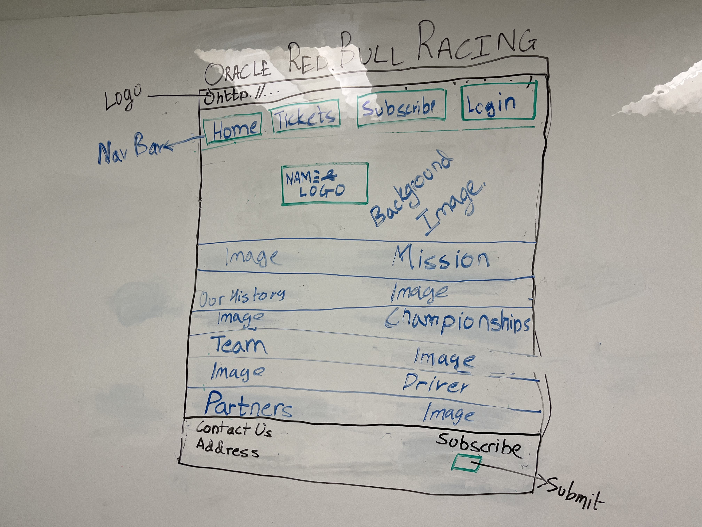

# Red Bull Racing Website

This is a simple HTML document for a Red Bull Racing website. Below is a breakdown of its structure:

## Contents
1. [Overview](#overview)
2. [Sections](#sections)
    - [Header](#header)
    - [Our History](#history)
    - [Our Mission](#mission)
    - [Championship](#championship)
    - [Our Drivers](#driver-info)
    - [Partners](#partners)
    - [Footer](#footer)
3. [Mockup](#mockup)  
4. [CSS Script](#css-script)

## Overview
This HTML document represents a basic website layout for Red Bull Racing. It includes a header, several sections detailing the team's history, mission, championship achievements, information about the drivers, partners, and a footer with contact information.

## Sections

### Header
- Contains navigation links for Home, Ticket, Subscribe, and Login.

---

### Our History
- Provides a brief overview of Red Bull Racing's history, including its origins and acquisition by Red Bull.

---

### Our Mission
- Outlines Red Bull Racing's mission and key milestones from its debut in 2005 to its dominance in recent years.

---

### Championship
- Displays Red Bull Racing's championship achievements, including Constructors' Championships, Drivers' Championships, race victories, and podiums.

---

### Our Drivers
- Features information about the team's drivers, Max Verstappen and Checo Pérez Mendoza, including their backgrounds and achievements.

---

### Partners
- Showcases the partners of Red Bull Racing with logos.

---

### Footer
- Includes contact information and a form for users to submit messages.

---
## Mockup

---

## CSS Script
- The stylesheet `styles.css` is linked to the HTML document to style its elements.

---
# Red Bull Racing Website CSS ReadMe

This repository contains CSS styles for the Red Bull Racing website.

## Navigation Bar
- `.nav-list`: Styles for the navigation bar.
    - `display: flex;`: Uses flexbox for layout.
    - `flex-wrap: wrap;`: Allows items to wrap to the next line if necessary.
    - `background-color: #FFCC00;`: Sets background color to yellow.
- `.nav-list li`: Styles for navigation bar items.
    - `flex-grow: 1; flex-shrink: 1;`: Allows items to grow or shrink as needed.
- `.nav-list li a.Login`: Styles for the login button.
    - `background-color: #DB0A40;`: Sets background color to red.
    - `color: white;`: Sets text color to white.
    - `border-radius: 5px;`: Adds rounded corners.
    - `padding: 10px 20px;`: Adjusts padding for better appearance.
- `.nav-list li a.Login:hover`: Styles for the login button on hover.
    - `background-color: #9B0430;`: Darkens the red color.

## Sections
- `.section1, .section2`: Styles for sections 1 and 2.
    - `opacity: 0;`: Sets initial opacity to 0.
    - `transition: opacity 1s ease;`: Adds transition effect for opacity change.
    - `text-align: center;`: Aligns content to center.
    - `margin-top: 50px;`: Adds top margin for spacing.
    - `display: flex; justify-content: center; align-items: center;`: Uses flexbox for centering.
    - `flex-direction: column;`: Stacks content vertically.
- `.driver-info`: Styles for the driver information section.
    - `display: flex; justify-content: space-around; align-items: center; flex-wrap: wrap;`: Uses flexbox for layout.

## History Section
- `.history`: Styles for the history section.
    - `color: white;`: Sets text color to white.
    - `display: flex; flex-direction: column; align-items: center; text-align: justify;`: Uses flexbox for layout.
    - `animation: fadeIn 1s forwards;`: Applies fade-in animation.
- `.history p`: Styles for paragraphs in the history section.
    - `max-width: 600px; padding: 0 20px;`: Sets maximum width and padding.

## Background and Body
- `body`: Styles for the body element.
    - `color: #fff;`: Sets text color to white.
    - `background-color: #23326A;`: Sets default background color to dark blue.
    - `background-image: url(./resource/Bulls.png);`: Sets background image.
    - `background-repeat: no-repeat; background-position: center; background-attachment: fixed; background-size: cover;`: Adjusts background image properties.
- `.second-background`: Additional styles for the second background.
    - `background-color: #DB0A40;`: Sets background color to red.

## Footer
- `footer`: Styles for the footer element.
    - `padding: 20px; border-top: 2px solid white;`: Adds padding and a border at the top.

## Form
- `form`: Styles for forms.
    - `margin: 0; float: right;`: Adjusts margin and floats the form to the right.
- `label`: Styles for labels.
    - `display: block; margin-bottom: 10px;`: Displays labels as block elements with bottom margin.

## Contact Information and Message Submission Form
- `.contact-info, .message-us`: Styles for contact information and message submission form.
    - `flex: 1;`: Allows elements to expand to fill available space.
    - `text-align: right;`: Aligns text to the right for the message submission form.

